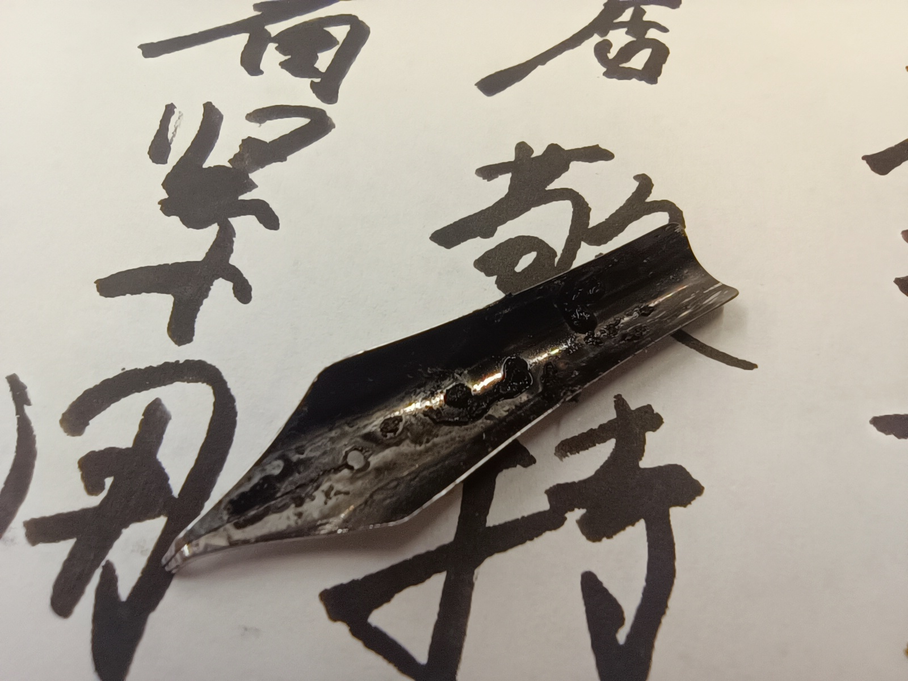
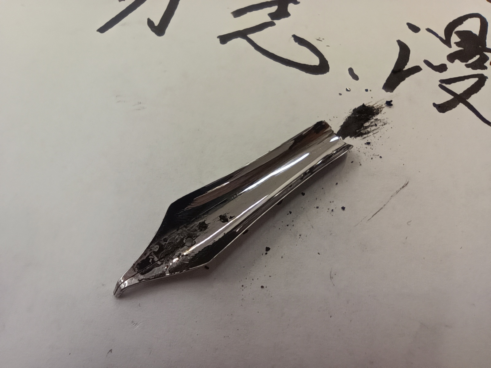
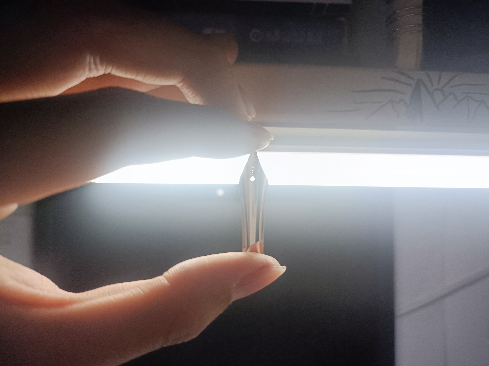
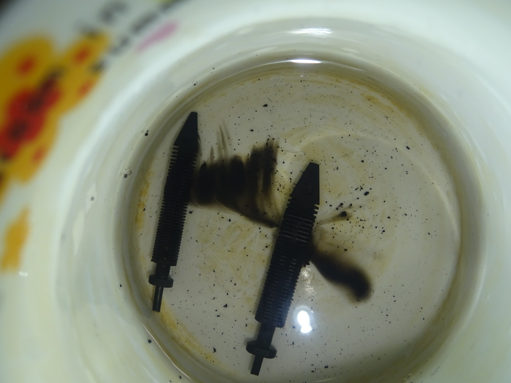
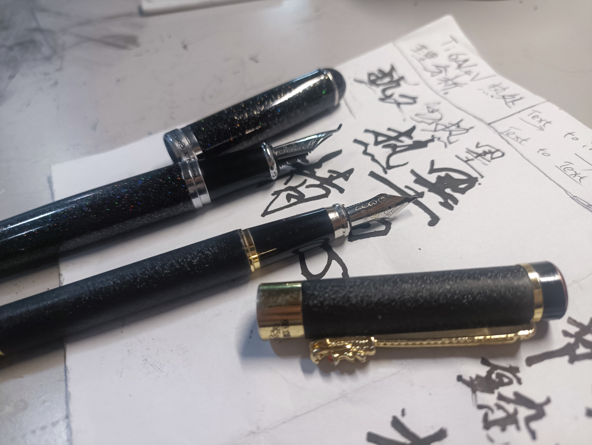

<widgetsai-input id="input1"></widgetsai-input>
<widgetsai-select id="select1"></widgetsai-select>
<widgetsai-submit id="submit1"></widgetsai-submit>
<widgetsai-result id="result1"></widgetsai-result>


<!-- @import "[TOC]" {cmd="toc" depthFrom=1 depthTo=6 orderedList=false} -->

<!-- code_chunk_output -->

- [墨之用](#墨之用)
  - [碳素墨水简介](#碳素墨水简介)
    - [碳素墨水制作原理](#碳素墨水制作原理)
    - [碳素墨水标准](#碳素墨水标准)
  - [墨水沉淀的解读](#墨水沉淀的解读)
    - [蓝蓝混合](#蓝蓝混合)
    - [蓝、蓝黑混合](#蓝-蓝黑混合)
    - [黑墨水（染料墨水）混合](#黑墨水染料墨水混合)
    - [碳素墨水混合](#碳素墨水混合)
- [笔之用](#笔之用)
  - [钢笔的结构](#钢笔的结构)
  - [钢笔的使用](#钢笔的使用)
  - [如何保养钢笔](#如何保养钢笔)
    - [轻度清理](#轻度清理)
    - [中度清理](#中度清理)
    - [重度清理](#重度清理)

<!-- /code_chunk_output -->


## 墨之用

### 碳素墨水简介
碳素墨水是一种字迹长期保存，水不褪色的墨水，它的坚牢度极强，具有优良的耐水性、耐光性及耐各种药品的腐蚀性。
碳素墨水用途广泛，特别适用于记载重要的档案文件，碳素墨水的这些优良性能是普通墨汁、各类染料墨水和鞣酸铁墨水所无法比拟的。
炭黑是碳素墨水的主要原材料，它是碳氢化合物经不完全燃烧成热解所得的炭素微粒，炭黑的化学组成是以元素碳为主体的，还含有硫、氢、氧等，炭黑是一种不溶于水的颜料。从电子显微镜观察，它的直径约为20~30纳米，炭黑的基本粒子都不是一粒粒单独存在，而是由许多粒子连成链状或团状的，这些粒子与粒子之问的联结非常坚固，但是经过一定时间的强力机械加工，炭黑的结构性遭到破坏，而改变了它原来的结构体。
为了使炭黑分散度更好，工业上一般对炭黑进行强力碾磨，主要不是在于使细微的炭黑磨细，而是破坏由于个别颗粒联结而形成的系统，即碾磨作用是在于使在介质中的炭黑的颗粒细质点的形成悬浮。一般来讲，颗粒越细，流利性就越高[^1]，
[^1]:许获三.碳素墨水新配方新工艺的研究[J].江西师范大学学报：自然科学版,1993,17(3):199-201232
#### 碳素墨水制作原理
我国碳素墨水的生产始于80年代初，其生产方法采用化学氧化法：
1. 炭黑在氧化剂（如HNO、KMnO、、KgCr2O,、H2O2等）的作用下制成氧化炭黑，使颗粒表现出-CO0H、-0H等亲水基团而产生较强的亲水性。
2. 将高色素炭黑研磨到一定的细度^[2]（通常为5~15μm）
3. 加上适量的稳定剂、悬浮剂、乳化剂、分散剂等，以增加炭黑的亲水性能，使炭黑长期稳定的在水中高度分散、悬浮，从而组成了类似胶体液 的混合物——炭黑分散体。

注意，碳素墨水的化学本质为类似胶体的混合物。所以不同性质的碳素墨水混合很容易会发生聚沉现象，具体原因在下一小节解释。

[^2]:钱翠英.碳素墨水的流利性[J].中国制笔,1994,0(2):29-30

#### 碳素墨水标准
作为国民生活必需之物品，碳素墨水也有其工业化标准[^3]。

[^3]:节选自中华人民共和国轻工行业标准 QB/T 2063-2007 碳素墨水

| 序号                                    | 项目         | 高级碳素墨水的 要 求        |
| --------------------------------------- | ------------ | --------------------------- |
| 1                                       | 色度         | 不低于高级对比色标*         |
| 2                                       | 酎水性       | 224h,线迹保持可见           |
| 3                                       | 耐晒性       | >72h,线迹保持可见           |
| 4                                       | 耐乙醇性     | >l0min,线迹保持可见         |
| 5                                       | 耐盐酸性     | >24h,线连保持可见           |
| 6                                       | 耐氨水性     | >24h,线迹保持可见           |
| 7                                       | 耐漂白性     | e5min,线迹保持可见        |
| 8                                       | 稳定性       | 色度不低丁80%浓度的对比墨水 |
| 9                                       | 问做书写/min | 230                         |
| 10                                      | 扩散度/级    | 3                           |
| 11                                      | 毛细扩散     | 扩散均匀                    |
| 12                                      | 墨水外观     | 表面无悬浮物,无异味         |

### 墨水沉淀的解读
通常认为不要混合使用不同颜色、不同厂家的墨水。如需另换墨水，要撤掉剩余的墨水，再将自来水笔用温水洗净，方可吸入所需的墨水。否则，不同的墨水会起化学反应，产生沉淀物，阻塞通道，影响出水[^4]。
[^4]:董川，温建辉，张俊编著.笔墨材料化学.北京：科学出版社，2005:50

但这究竟对不对呢？为此，我找到了一篇山西大学2006做的二十种墨水的交叉混合实验[^5]，研读后发现实验的结果与人们印象中的稍有不同。
[^5]:温建辉,程新红,董川.书写墨水的酸碱性与相容性研究[J].中国制笔,2006(3):32-34

文献中的试验结果显示：纯蓝墨水、蓝黑墨水之间混合后既无沉淀产生，也无褪色现象。所以下面这三种情形都可以混合
- 纯蓝墨水与纯蓝墨水、
- 纯蓝墨水与蓝黑墨水、
- 蓝黑墨水与蓝黑墨水

但是纯蓝墨水、蓝黑墨水都不可以与碳素墨水或绘图墨水混合使用！
实验中的如英雄碳素墨水、鸵鸟碳素墨水、鸵鸟绘图墨水、泸光绘图墨水、上海碳素墨水，凡与之混合的墨水均有大量的沉淀产生。即便同是碳素墨水或绘图墨水，不同厂家的墨水混合也会有沉淀。黑墨水与其它墨水混合大部分也有沉淀产生。将上述170个交叉结果放置一星期继续观察，现象基本一致。
对于这些奇怪的现象，作者这样解释几种混合墨水沉淀与否的机理：
#### 蓝蓝混合
纯蓝墨水属于染料型墨水，又都是酸性的。所用的着色剂一般是酸性墨水蓝G、直接湖蓝5B(一种颜料)。酸性墨水蓝属三芳甲烷类染料，极易溶于水中呈蓝色溶液，主要用于制造纯蓝和蓝黑墨水，还可用于制做色淀，蓝印台油墨，用于皮革染色和生物的着色。

酸性墨水蓝G和直接湖蓝5B都是在酸性介质中稳定，随着体系 pH的增大，颜色由蓝变为浅紫色。尽管不同的纯蓝墨水组成配方不尽相同，两种颜料的含量也有差异，但混合后仍属于稳定体系，所以不同的纯蓝墨水之间可以混合使用。

#### 蓝、蓝黑混合
蓝黑墨水中形成色素的主要原料是鞣酸、没食子酸、亚铁盐及染料。
- 鞣酸又称单宁酸，分子式$C_{76}H_{52}0_{46}$，它是植物鞣料的主要成分；
- 没食子酸又称五倍子酸，化学名称是3，4，5-三羟基苯甲酸,分子式$C_7H_6O_5$。
鞣酸与亚铁盐（一般为 FeSO4·7H20）生成鞣酸亚铁，没食子酸与亚铁盐生成没食子酸亚铁，二者完全溶于水，但书写时颜色较浅，在空气中氧化后才能逐渐变为灰黑色、不溶于水的鞣酸铁和没食子酸铁，前者耐水，后者耐光。
为了使初写时的颜色不至于太浅，人们一般往墨水里加了蓝色的有机染料酸性墨水蓝G或直接湖蓝5B，墨水蓝是墨水的主色，直接湖蓝5B起助色作用。这样，初写时以蓝色为主，一段时间后变为黑色，因而称为蓝黑墨水。这类墨水的稳定剂是酸，溶液pH<2，所以，蓝黑墨水和纯蓝墨水之间都可以混合使用。

#### 黑墨水（染料墨水）混合
黑墨水主要成分是高级黑色有机染料，如直接耐晒黑（一种染料），属于染料型墨水。试验表明既有酸性的也有碱性的，显然所含的黑色有机染料不相同。由于介质的酸碱变化会引起分子结构变化，从而产生颜色变化或沉淀，因此，不仅黑墨水与其它墨水不能混合，而且不同品牌的黑墨水之间混合也可能有沉淀产生。
#### 碳素墨水混合
碳素墨水和绘图墨水都属于颜料性墨水，主要着色颜料是炭黑，有时也添加一些直接黑染料。
前文说过，炭黑是一种不亲水的黑色粉末，即使将炭黑磨的很细，加水后也不能制成墨水，必须经过处理或添加具有特殊功能的助剂才能制成墨水。
这些墨水都具有胶体的性质，添加电解质或改变酸碱性都有可能引起胶体的破坏。试验表明碳素墨水既有酸性的也有碱性的，绘图墨水略显碱性，由于所加的稳定剂差异很大，形成的胶粒带有不同的电荷，因此，碳素墨水、绘图墨水不仅不能与其它墨水混合，而且不同品牌的碳素墨水、绘图墨水之间混合也会产生沉淀。

## 笔之用
### 钢笔的结构
常见的钢笔结构：
- 笔杆
- 笔颈
- 笔帽
- 笔颈上下端螺纹连接的上套和下套
- 插套在笔颈下端的墨囊
- 插装在笔颈上孔中的笔舌、笔尖、
- 插装在笔舌排气孔中的排气管

### 钢笔的使用
1. 使用恰当的笔力：使用恰当的笔力，不要太轻也不要太重，以免破坏笔尖或破坏书写表面。 
2. 使用正确的笔法：使用正确的笔法，避免在书写过程中刮伤纸张或污染书写表面。 
3. 注意维护：使用完后，及时清洁笔尖，清洁笔芯，以保持钢笔的性能。

### 如何保养钢笔

#### 轻度清理
日常使用时可以轻度清理，每周把笔头洗一次，用半湿的餐巾纸或有酒精的湿纸巾轻轻擦拭钢笔周身。
#### 中度清理
轻度堵墨时需要简单拆解：把上墨器或者笔杆的开口处浸没在一杯水里，反复吸取和排出清水，直到干净为止（对着自来水冲最方便）；再把上墨器或者笔杆重新装回笔握部分；再把整个钢笔浸没在一杯水里，反复吐水几次，直到干净为止。
#### 重度清理
重度堵墨时，也就是说上面两种方法都失效时，需要大拆，这也是我今天遇到的情况。
~~博主~~（这个词好难听）笔者我的钢笔有两支，一支是父亲送的**英雄6006**，一支是网购的**金豪X750(弯头)**，用了大概有两年，从来没有彻底拆开清洗过。之前一直用的挺好，隔两天洗洗也没有什么毛病。但上星期那会儿在图书馆写着写着出事了，英雄笔用的晨光的墨，金豪笔用的一得阁的墨，后者笔迹粗，练字好用，墨先用完了，正不知怎么解决，偏偏灵光一现，手贱把两只墨囊换了下，还自作聪明的写了好久。晚上还专意把两支笔都好好泡了泡、洗了洗，打算以后就专用晨光的墨了。
悲剧在第二天发生，在我把洗过后的笔抽上墨后，不管哪支笔，都在写了一会后就断墨，每写一会儿就要拆开打墨，不胜其烦。今晚在网上浏览了一番，发掘拆开笔的清洗方法很是高效，手一痒，便拽开了（两手墨）,原来钢笔尖这般好拆！


拆解钢笔的方法取决于钢笔的类型和结构，一般可以分为以下几种：(来自Bing的回答)

需要用拆卸工具的，例如国笔经典英雄100，有工具，再找个视频，就可以。
不需要拆卸工具的，主要可以分为活塞钢笔和上墨器的钢笔。活塞钢笔劝你还是别拆，一般都比较贵；上墨器的钢笔则可以用笔盖压住笔尖，向后拉笔杆，就可以拆下钢笔尖。
如果想拆下笔芯的话，就将笔盖按在笔尖往上一点的塑料处，同样的拉动，就可以抽出。

回到宿舍后，找了个杯子，又把笔舌，笔颈拆开仔细泡了泡，笔舌的中沉淀已将毛细结构堵死了，又用小刀把缝里边的沉淀一点点挖出来，最后又泡了好久，这才把笔舌清理完。

终于清理完了，吃一堑长一智，以后绝对不把碳素墨水混合了！（下回把蓝墨水与红墨水混合起来玩玩，似乎还没人做过这个实验）

