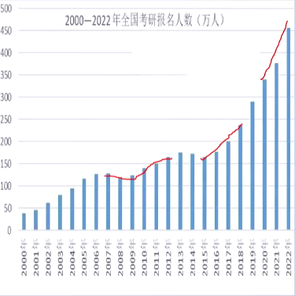

# 糟糕的预期

现阶段考研的情形：考研人数变多导致分数线升高，难度提高了。

# 大纲结构（头重脚轻）

I．考试性质（1）

 II．考查目标（2—3）

III．考试形式、考试内容与试卷结构（4—6）

IV．题型范例、参考答案及评分参考（7—33）

附录1：**词汇表**

附录2：**前后缀—国家（地区）—大洲名和大洋名—缩写词**

附录3：试题和参考答案

附录4：答题卡 

# 变化

1. 阅读理解总字数增加(增加100词=大概四句话)：阅读适当增速
2. 理解文章论证方法、比较不同观点：注意**理解**段落大意
3. 使用恰当衔接手段建构连贯语篇能力：上下文

> 平时多流汗，战时少流血。

4. 阅读理解范围：经济、社会、文化、科普、管理（注意**教育、就业**）
5. 小作文：通知告示、公文信件、个人信件、**备忘录**
6. 大作文：图、表、应用文、**文字、报告**

# 对策

1. 背单词（分主题记忆，分类总结，避免混乱）、长难句解析只是基础🐷

2. 加强段落主旨的归纳练习✍️

   比如出了一道题：比较某两个段落之间的区别，则需要阅读更多的句子。

3. 阅读增速⚡

4. 小作文：注意**感谢/道歉/祝贺、邀请信、建议/推荐**

5. 大作文：注意**科技、人生价值观、学习择业**

6. 作文对策：熟悉考频、造模板、熟练用词

# 误区

> 找不到自己的缺点，勤奋也会变成精神压力。

> 考研是作战不是作秀。

1. 前期背词，后期**过词**
2. 注意审题，客观看待模板，会默写模板
3. 以“写”的思想去背作文，形成自己的表达体系

# 复习计划调整

1. 阅读：熟做五年之内的真题；针对性练习模拟题
2. 翻译：考前必翻31句
3. 写作：针对性练习模拟题
4. 完形：用概率排查