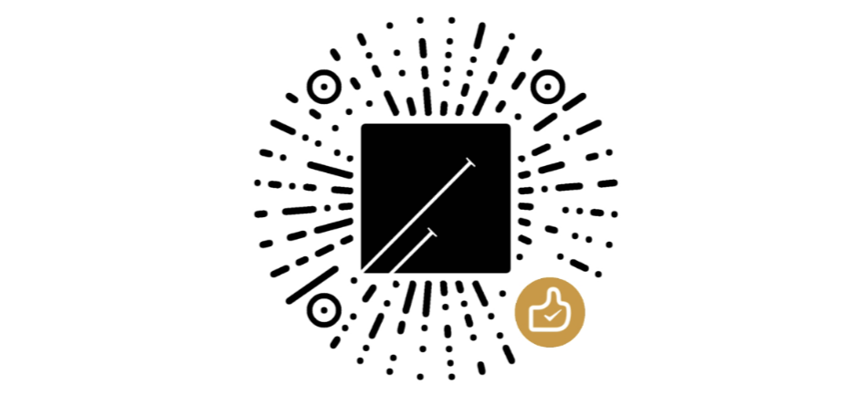

> 人是各种社会关系的总和，博客是人与内容的总和。

## 关于博客站点——子虚栈

### 它是什么？
首先作为网站，它是一个以Hexo为框架的、以Cloudflare CDN节点为数据储存的、以Waline为评论系统的、代码托管于GitHub上的静态博客站点，博主/站长/Blogger为@田欣洋/@sion tian/@秉蕳(以下统称为所有者)。

其次作为网志(Web log)，它是所有者以电子化的方式记录日志、念头、想法的网络笔记本。

最后作为平台，它是所有者创作内容、总结经验，兼与他人进行互动的半自媒体平台。

### 它从哪里来？
就起源而言，它是所有者在学习Linux过程中得到的副产品。

就数据而言，它由Cloudflare提供的分布于世界各地的主机提供的。

就内容而言，它是所有者日常生活中各种念头的具象化——以文本与影像为载体。

就网站主体的筑建而言，它是许多开源项目的组合。
#### 博客骨架的创造者们
* 感谢 [@陳嘉輝（Tommy Chen）](https://zespia.me/about/) 开发的Hexo博客框架
* 感谢 [@CrazyWong](https://crazywong.com/) 开发并<u>不断维护</u>的🦋Butterfly主题
* 感谢 [Waline](https://github.com/walinejs/waline) 提供的评论服务
* 感谢 [Github](https://github.com/about) 提供的Pages、Actions服务
* 感谢 [Vercel](https://vercel.com/about) 、 [Zeabur](zeabur.com) 、[Railway](https://railway.app/) 提供的部署服务
* 感谢 [Cloudflare](https://www.cloudflare.com/zh-cn/people/) 提供的CDN服务
* 感谢 [@Chanzhaoyu](https://github.com/Chanzhaoyu) 提供的[ChatGPT实用网页Docker](https://github.com/Chanzhaoyu/chatgpt-web)
* 感谢 [Fontawsome](https://fontawesome.com/) 提供的精美图标
#### 博客写作工具的创造者们
* 感谢 [@Licat（Shida Li）@Silver（Erica Xu）](https://obsidian.md/about) 等人开发的Obsidian笔记软件，方便了博客的写作与管理
* 感谢 微软开发的 [Visual Studio Code](https://github.com/Microsoft/vscode/)，方便了博客的部署与管理
#### 博客插件的创造者们
* 感谢 [@Tony Grosinger](https://grosinger.net/)开发的[先进表格插件](https://github.com/tgrosinger/advanced-tables-obsidian)，方便了表格的插入
* 感谢 [@PJ Eby](https://github.com/pjeby)开发的[tag-wrangler](https://github.com/pjeby/tag-wrangler) 方便了标签的管理
* 感谢 [Memos-ers](https://usememos.com/)开发的Memos 与[ @Boninall](https://github.com/Quorafind/) 开发的 [Obsidian-memos](https://github.com/quorafind/obsidian-memos)，方便了想法的记录
* 感谢 [@shd101wyy (Yiyi Wang)](https://github.com/shd101wyy) 开发的[vscode-markdown-preview-enhanced](https://github.com/shd101wyy/vscode-markdown-preview-enhanced)插件，方便了目录的生成
* 此外还感谢如下npm插件与hexo插件的开发者，这些优质插件极大地丰富了博客的功能：
```json
 "@neilsustc/markdown-it-katex": "^1.0.0",
    "hexo": "^5.0.0",
    "hexo-abbrlink": "^2.2.1",
    "hexo-auto-category": "^0.2.1",
    "hexo-blog-encrypt": "^3.1.6",
    "hexo-butterfly-charts": "^1.1.3",
    "hexo-butterfly-extjs": "^1.4.4",
    "hexo-butterfly-tag-plugins-plus": "^1.0.17",
    "hexo-calendar": "^1.0.8",
    "hexo-deployer-git": "^3.0.0",
    "hexo-filter-image": "^1.2.3",
    "hexo-generator-archive": "^1.0.0",
    "hexo-generator-category": "^1.0.0",
    "hexo-generator-feed": "^3.0.0",
    "hexo-generator-indexed": "^1.2.1",
    "hexo-generator-search": "^2.4.3",
    "hexo-generator-seo-friendly-sitemap": "^0.2.1",
    "hexo-generator-tag": "^1.0.0",
    "hexo-hide-posts": "^0.2.0",
    "hexo-markmap": "^1.1.7",
    "hexo-pdf": "^1.1.1",
    "hexo-renderer-ejs": "^2.0.0",
    "hexo-renderer-markdown-it-plus": "^1.0.6",
    "hexo-renderer-pug": "^3.0.0",
    "hexo-renderer-stylus": "^2.0.1",
    "hexo-server": "^2.0.0",
    "hexo-tag-aplayer": "^3.0.4",
    "hexo-tag-dplayer": "^0.3.3",
    "hexo-tag-echarts-new": "^1.0.1",
    "hexo-tag-echarts3": "^1.1.2",
    "hexo-wordcount": "^6.0.1",
    "markdown-it-attrs": "^4.1.6",
    "markdown-it-cjk-breaks": "^1.1.3",
    "markdown-it-container": "^3.0.0",
    "markdown-it-task-lists": "^2.1.1",
    "save": "^2.9.0",
    "three": "^0.138.3",
    "uuid": "^8.3.2"
```

#### 其他的源头活水
* 感谢 [WhereMyLife](http://wheremylife.cn/home#top) 提供的Kindle RSS 订阅新闻推送服务
* 特别感谢叶圣陶老师所著的『怎样写作』、『文心』
### 它到哪里去？
就受众目标而言，**所有者本身**首当其冲，其次为**能理性思考、对内容有兴趣、以礼待人的**世界各国同胞(以下简称来访者)。

就直接目标而言，它是一个为了满足社会性动物获得认同的工具。

就内容目标而言，它将包含材料科学、数学、计算机科学、哲学、文学、摄影等方面的内容，此即初心❤️所在。

就终极目标而言，它的目的在于：让所有者在写作过程中不断完善人生观，认识自我，摆脱自身局限性，探寻人生的终极意义。
### 它不是什么？（第三周年往后）
它不是一个盈利的工具，不以流量为目标。

它不是微博、朋友圈、QQ空间，埋填各种空虚的欲望。

它不会分享浮躁的、肤浅的、速朽的经验技巧。

---
它不是没用的热情。

### 对于来访者的态度
🍬本站**坚决**尊重所有来访者对于隐私与个人信息保护的强烈要求，然而为了能让所有者可以更好地维护站点，本站使用了一些分析工具，它们会在访客浏览过程中，收集包括**浏览器标识、ip地址、地理位置、电子邮件**等信息。所有者**坚决**承诺不会将收集的数据泄露给任何其他组织机构！

🎭本站用到的分析工具有
1. [ClustrMaps](https://clustrmaps.com/policy)：会收集浏览器标识、ip地址。
2. [Microsoft Clarity](https://privacy.microsoft.com/zh-cn/privacystatement)：收集访问操作过程和资源加载情况 。
3. [Waline](https://waline.js.org/advanced/privacy.html)：收集评论者的浏览器标识、ip地址等。

温馨提醒：来访者可以利用浏览器自带的隐私保护功能、广告拦截插件等轻松地进行追踪的屏蔽。

<!-- ### 互动与交流
为了方便交流，来访者可以
1. 评论区留言
2. 邮件互动（站长邮箱 me@si-on.top）
3. 讨论组，所有者经营有如下讨论组(开始于2023-4-21)：
	* Slack：[邀请链接](https://join.slack.com/t/siontian/shared_invite/zt-1tgrnh9k1-AtMEpbYwOiv7ZxbYVAfOBg)
	* Telegram：[群组链接](https://t.me/sionDaoDaoDao) -->


<!--
### 关于成本与打赏
本站运行无硬成本，唯有域名每年需耗费$5≈￥36。所有者暂无经济来源，建站至今成本皆由父母维持。

本站非以盈利为目的，如若文字对来访者有所帮助，可考虑打赏一二。

| 施者 | 施金 |   时间   |   缘由   |
|:----:|:----:|:--------:|:--------:|
| 过客 |  30  | 2023/6/9 | 人情互助 |

-->

## 关于博客作者

<div class="btn-center">






</div>

### 真实信息
> 社会心理学表明**去个性化**(比如匿名等)会让人表现出来更多的冲动的行为(比如野蛮思考、徘徊于灰色地带、发表愤世嫉俗言论等)，而**自我意识**(标示出真实身份)则会让人表现的更加理性谨慎(比如发表意见时时多次斟酌、行事小心翼翼等)。经过考量，也是为了对来访者负责，我决定半匿名化，以笔名『秉蕳』『应律』等作为日常活动的身份，而基本的真实信息在此下面可以获取。
> <p align="right">——2023.2.19 关于匿名与否的考量</p>

### 最低限度之基本信息
- 性别:♂
- 年龄: 22(2001)
- 贯籍: 河南
- 信仰：坚定的无神论+些微不可知论+些微泛神论
- 受教育水平: 大学本科📈
- 现阶段(2023/6): 二次考研中...

### 阁主自传(仿古)
#### 名
阁主姓田，名欣洋，字秉之，自号子虚栈主。『尔雅』曰：欣，乐也；洋，多也，因之此名可解作**欢乐之多者**，亦可释为**好多者**。

朱光潜先生『谈美』曰：斯美之要义在于**有直觉之欣赏**，而欣赏之预备乃充分之了解，由此观之，“欣”、“洋”二字亦可视为一训：
* 以无所往之直觉欣赏万物而悦于本心，美之质也；
* 格物探赜宇宙之洋洋大观以致知明辨，真之体也。
* 以所得智识改造完善令世界近乎仁美，善之用也。

> 白：此名之缘由，乃余幼时父母求之于算名先生而得，先生卜得余四行皆全，独缺水也，遂名以无限水大洋之洋以补之。“嘻，此儿此生定不缺水也！”

#### 评
阁主其人，木讷好学，涉猎宽泛。天文、声乐、绘素、摄像、诗文，皆能晓知一二，却不甚解。欲为博学之士，类达芬奇之属，常于僻静处慷慨言志，又多为繁琐事摇摆，碌碌然缓缓趋近。术业专攻材料学，善桥联诸物，或将有所作为。

好远游，然不可常得。故常耍玩近郊，或徐行，或骑车，觅未知之境，观非常之景，专好行于人迹罕至之殊途。或见诸山林俊美，流雾霞光，水天一色，洋洋大观，常欣欣然喜不自胜。

少不更事，常为新奇技术所迷。曾为黑莓Priv优化、系统重装而接触Linux，继而有志建站，期年之后，建成部落阁『子虚栈』一座。后常著文章于阁中以自娱，颇示己志。忘怀得失，以此自终。

#### 热情（小结于壬寅年冬）
* 音乐（节奏至上）：流行、古典、流行与古典的Remix、蓝调(2021)
* 摄影（直觉至上）：山、水、云、光、人文、建筑
* 书法：楷、行、颜体、直排版、
* 传统：珠算、口哨、自行车、爬树、~~捉鱼儿~~、奇石(+2023)
* 亚文化：奥特曼、星球大战、魔戒、星际牛仔、蒸汽波
* 游戏：~~泰拉瑞亚、雷鸣风暴、海岛奇兵、铁锈战争、王国保卫战~~
* 计算机诸类（外观至上）：Linux、LaTeX、Win11、Hexo博客、
* 软件：Adobe illustrator2022、Blender、UGNX2206
#### 术业
* 数学：多项式计算法(手算开平方、群论...)、统计学、计算方法、图论
* 力学：理论力学、材料力学、弹性力学
* **材料科学**：晶体学、物理化学、固态相变、焊接
* 其他：无机化学、光学、天文(节气、日月相)
* 文：唯物主义哲学、普适达尔文主义、传统诗词、传统中国文化
## 公钥
本站提供公钥来满足加密信息传递的需求，您可以使用本站的公钥加密信息，而此信息只有拥有私钥的所有者才可以解密。
### GPG/PGP公钥
```asc 
-----BEGIN PGP PUBLIC KEY BLOCK-----

mJMEZA7i9RMFK4EEACMEIwQBTsjgSQ6017ioBjchqBt7iZZz5uFLv4DT9XBKlVZ/
s2mFlEsedYxQOsApvH5MrwNjhdwr8ZZTp11D34Cre9stzYsAvHFj5NwAfCZpdLu1
VGcWbTAJGiImmjFO1vc6d96H8T2jqg2r83jLrAE7ThmL7uDhRyg1g9rR8+PyOJSD
xYfjIFW0FeenieiVsyA8bWVAc2ktb24udG9wPojWBBMTCgA7FiEEyryNxSaIcGDA
AwD/tARTq6biU6wFAmQO4vUCGyMFCwkIBwICIgIGFQoJCAsCBBYCAwECHgcCF4AA
CgkQtARTq6biU6y9RAIHafEG1K2eKcVAviYY4G7s5fMw6cxopPJ4U1udNh+uluyr
g7jDlToN3sfz9soijjdxPdtLoYkovX5fEju7AwbjiaICCQGVnnc5dDuTakJrMSb0
EIEqJeLwHe2vsBZXJNLJtjxB+NI2i8kmzWgQzCsizjnFxXtK9bmN3XtS+LIpTMa5
bm8kM7iXBGQO4vUSBSuBBAAjBCMEAfW/WGI6KQBPIWBpsXXhNWyEpXrJNinHLYwD
rbja3f9hqOhmEp8aoquqixu8UdScECr0KtWMBFxNrGVmJ0eq1YfZANDn74mm0pAs
rVMTwEjMgS4Urkka5NFUfj9X1KyZFW/sTSl12DUY22vKeTa/3slAfAYLlJVX+Efa
/Vd+5D3vMsspAwEKCYi7BBgTCgAgFiEEyryNxSaIcGDAAwD/tARTq6biU6wFAmQO
4vUCGwwACgkQtARTq6biU6ztowIJAUvMqRgtd7tMkT+ma53imil6JfEBEGwtb94I
a4y1BuHbsfcii1wBqvevhyg0U/8PNG6qoQyBwq/7wBZzO4ArMbs1Agi5v7c7z80G
8jqoaAE2OXVOf1iTx5kyaakBfYB3SfXre33DEeJUAE/ErT3prkR+q+QKLW1IG1lH
FX9WwCEGotRk8g==
=aFbQ
-----END PGP PUBLIC KEY BLOCK-----
```
公钥指纹：`CABC8DC526887060C00300FFB40453ABA6E253AC`
### ssh-ed25519 公钥
```bash 
# SSH版本
OpenSSH_for_Windows_8.6p1, LibreSSL 3.4.3

# 公钥
ssh-ed25519 AAAAC3NzaC1lZDI1NTE5AAAAIHnsLiDVwyucRqiew2m3fRp8C7COJbhMmNz0wBnWYsgX me@si-on.top

# 指纹
SHA256:MUjOogdBrahUpUehhAuf9pj15EhqQZW75JpTWegYDwk me@si-on.top

# 结构化图形
+--[ED25519 256]--+
| .++o=o          |
|E.oo*+ .         |
|.=+*.++ o        |
|.oXoB.o  o       |
|o..^.O  S        |
|. *.X o          |
| . +             |
|  +              |
|   .             |
+----[SHA256]-----+
```




<!-- 唯一可以让人进步的就是深刻的自我剖析与自我批评
2020-2-29[^1] 关于内心的批评
现在好似拔出土的豆芽-头不着天，根不着地。追名则必逐利，逐利者，我所深恶痛绝者。然此刻细察内心，竟犹犹豫豫，似多有沾染。近来心无力，想改变却不能，不想放弃挣扎，心中却有个念头在背后操控，让赤心失却挣扎之欲望，悲哉！惶哉！吾所向往之内心，竟然只存于想象之中、表层之中乎？然深层之心却已被侵蚀腐化，那侵蚀过的心：为保持虚荣，而让表层的心尽做些虚伪堂皇的事（所暗指者，社交也）。悲哉！惶哉！决计不可为欲望所支配，沦落到内心泥泞的荒野之中！非当头棒喝不可除净虚伪追名之戾气也！ 
2020-3-1 彻底的反面自我批评
吾所乐者，实乃展现我小小成就予众人以观，以求众人赞之、喝彩之。浮沉于虚幻的泡沫（所谓游戏、电影之属也），借一电脑，两手机，盯住荧屏，死死苦想以求哗众之言语，至死方休！迷茫，不满足于行走在这条平凡之路上，总想去人之所未至之处，自以为所知甚为博广。骄傲，为一点小事就沾沾自喜；懦弱，为一点小事就垂头丧气。
汝！宇宙之污秽！人类之败品！无有坚持之品性，一昧的拿来，把别人的成果东拼西凑，凑出个四不像来哗众取宠。卑劣的Loser！汝会个甚么？最擅长之事唯有**欺骗自己**而已。
[^1]:也是人生第一次装上linux系统(Deepin 15)的一天
-->


<!---
## 人生中的四十个问题(2023-2-14)

> [kepano/40-questions: Questions that I ask myself at the end of each year and each decade. (github.com)](https://github.com/kepano/40-questions)

1.  (mod)你如何看待死亡？
> 	死亡是生命中为数不多的确定事实之一，也是我们诸多最强烈态度自己最深层价值股的来源之一。


1.  若拥有亿万财富，你会做什么？
2.  现在的你会给十年前的你一些什么建议？
3.  你希望十年之后，什么依旧保持一致？
4.  你希望十年之后，什么是发生了变化？
5.  在你心中什么是最完美的幸福？
6.  何时何地，你最幸福过？
7.  为什么每天要起床？
8.  什么是最痛苦的？
9. 你的性格是什么？
10. 你最害怕的是什么？
11. 你最想培养的特质是什么？
12. 你最希望别人的拥有的特质是什么？
13. 什么时候会骗自己？
14. 浪费过什么？
15. 什么样的美德被过誉了？
16. 你最不喜欢自己外表的什么方面？
17. 如果你能改变一件事情，那是什么？
18. 你期望什么样的天赋？
19. 别人通常会误解你什么？
20. 你欣赏男人身上的气质是什么？
21. 你欣赏女人身上的气质是什么？
22. 你最看重朋友的什么？
23. 过去一年，最大的成就？
24. 如果你可以给每一个人同样一个礼物，那是什么？
25. 时间浪费在什么上了？
26. 最痛苦却又最值得做的是什么？
27. 你最想去什么地方生活？
28. 你最喜欢的一件东西？
29. 谁是你最好的朋友？
30. 谁或什么是你最珍贵的？
31. 当今世上，你最欣赏的人是？
32. 你最欣赏的一个小说英雄？
33. 你觉得和哪个历史人物最像？
34. 最后悔什么？
35. 你希望以何种方式结束自己的生命？
36. 座右铭是？
37. 你受到最好赞美是？
38. 最幸运的一件事是？
39. 什么让你充满了希望？
40. -->
